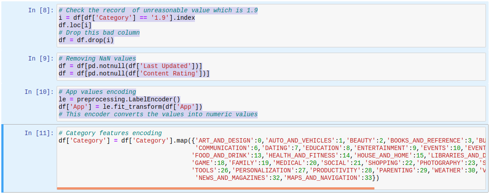

# simple Machine Learning example

### Introduction
From google playstore dataset, I made this project for Exploratory Data Analysis and
made some prediction model.
### Import libraries

### Data Collection

Data collection is the process of gathering and measuring data, information or any variables of interest in a standardized and established manner that enables the collector to answer or test hypothesis and evaluate outcomes of the particular collection

### Column List

- App: Application name
- Category: Category the app belongs to
- Rating: Overall user rating of the app (as when scraped)
- Reviews: Number of user reviews for the app (as when scraped)
- Size: Size of the app (as when scraped)
- Installs: Number of user downloads/installs for the app (as when scraped)
- Type: Paid or Free
- Price: Price of the app (as when scraped)
- Content Rating: Age group the app is targeted at - Children / Mature 21+ / Adult
- Genres: An app can belong to multiple genres (apart from its main category). For
eg, a musical family game will belong to Music, Game, Family genres.
- Last Updated: Date when the app was last updated on Play Store.
- Current Ver: Current version of the app available on Play Store.
- Android Ver: Min required Android version (as when scraped)

Looks like there are missing values in "Rating", "Type", "Content Rating" and "Android Ver". But most of these missing values in Rating column.

### Data Cleaning and Creating Dummy Variables
There are two strategies to handle missing data, either removing records with these missing values or replacing missing values with a specific value like (mean, median or mode) value of the column

### Categorical Data Encoding
Many machine learning algorithms can support categorical values without further manipulation but there are many more algorithms that do not. We need to make all data ready for the model, so we will convert categorical variables (variables that stored as text values) into numerical variables.

### Feature selection
In this section shows how k-nearest neighbors and random forests can be used to predict app ratings based on the other matrices. First, the dataset has to separate into dependent and independent variables (or features and labels). Then those variables have to split into a training and test set

During training stage we give the model both the features and the labels so it can learn to classify points based on the features

### Training & Testing of Model

#### Question (1): How we can predict app rating?
I will use SVM regressor
    As the name suggest the SVR is an regression algorithm , so we can use SVR for working with continuous Values instead of Classification which is SVM
    

We can see accuracy for SVM is high to predict app rating and there above example to predict one data row and the predict rate is 4.35

#### Question (2): How we can predict price?
I will use Random Forest is a classification algorithm consisting of many decisions trees.
It uses bagging and feature randomness when building each individual tree to try to create an uncorrelated forest of trees whose prediction by committee is more accurate
than that of any individual tree

We can see accuracy for RandomForest is high to predict price and there above example to predict one data row and the predict price is 29.99

#### Question (3): Does App size affect downloads?

We can see here there is a weakening positive relationship to the amount of people willing to download a bigger app. Since the apps get bigger and bigger, more people are willing to download them. Though this graph could hold true to a new theory that more people download apps that are rich in resources and functionality. And these apps just so happen to be bigger in size because of it. Also, nowadays, the size of an app is no longer a concern with the growing memory size of smartphones. And the increase in uncapped connection to the web. Naturally, as the relationship weakens, it proves that there still is a limit to what people are willing to download when it comes to app sizes.

#### Question (4): Which Category has a highest Reviews?

We can see in above plot the relation between Category and reviews and we can notice we have two category have a highest review are Communication and Social

#### Question (5): which features are effects on the rating for app?

We can see in above plot the relation between all features in the dataset, and we can see the features are effects on the rating are (LastUpdated then Type then Genres then Category)

#### Question (6): What is the most common factor between the highly rating apps?

#### Question (7): What is the most common factor between the lowlessly rating apps?

we can see in above plot the most common factor between the lowessly rating apps is the size

## License

MIT

_Thank you! ,_ 
**AbdAlmassry**
